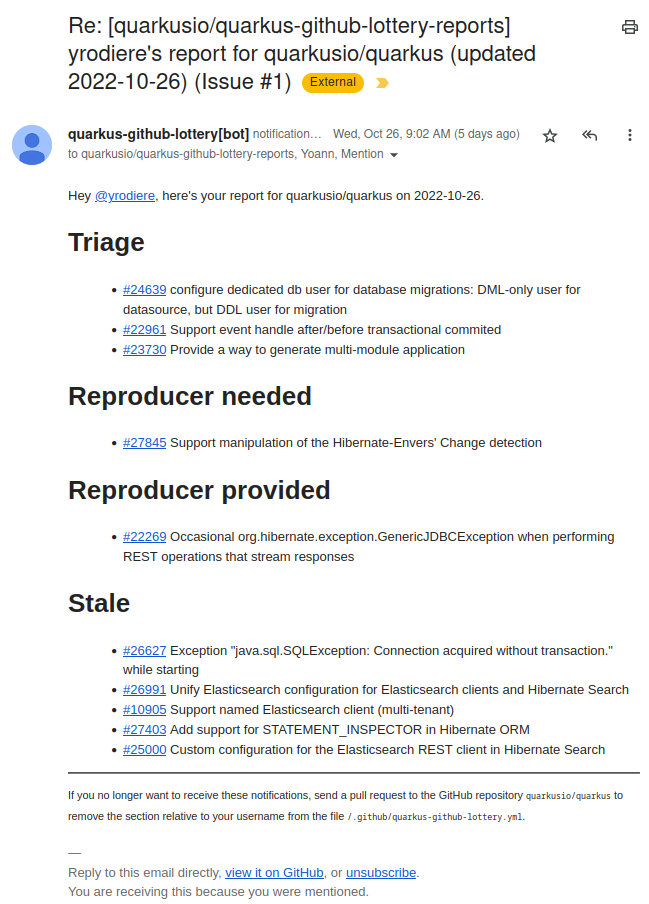
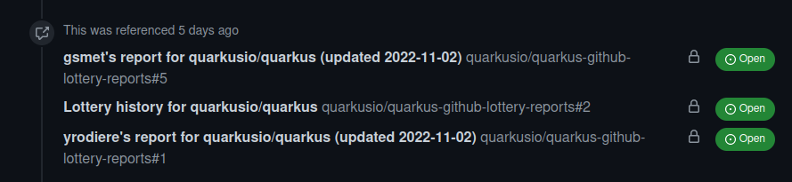

= Quarkus GitHub Lottery

> A Quarkus-powered GitHub App that regularly sends short lists of GitHub issues/PRs for triagers/maintainers/stewards to consider.

[[intro]]
== Introduction

This GitHub App is based on the https://github.com/quarkiverse/quarkus-github-app[Quarkus GitHub App framework].

It periodically extracts GitHub issues/PRs from one "source" GitHub repository (e.g. https://github.com/quarkusio/quarkus)
and notifies maintainers about them by commenting on GitHub issues in another "notification" GitHub repository
(e.g. https://github.com/quarkusio/quarkus-github-lottery-reports).
That second "notification" repository <<admins-install,may be private>>,
as it's only about notifying maintainers.

Each maintainer who participates in the lottery (opt-in)
gets their own dedicated GitHub issue in the "reports" repository,
on which the application will add one comment mentioning the maintainer
each time its sends a notification.
That way, maintainers will get daily (or weekly) reports via email,
sent by GitHub when the comment is added.

Issues/PRs are randomly assigned among eligible maintainers up to a limit they define themselves,
so that everyone gets a chance to help according to the time they want to invest.

There are multiple categories of issues/PRs that one can be notified about;
see <<maintainers>> for more information, but here's what an email notification may look like:

[[maintainers]]
== Triagers/Maintainers/Stewards: how to get notifications

[[participants-basics]]
=== Basics

As a Quarkus triager, a Quarkus core/extension maintainer, or a Quarkus steward,
in order to get notifications about Quarkus issues/PRs on GitHub:

* Make sure you have access to the https://github.com/quarkusio/quarkus-github-lottery-reports["notification" repository]
  if not, request access to an admin of the https://github.com/quarkusio[quarkusio] organization.
* Send a pull request to the "watched" repository (most likely https://github.com/quarkusio/quarkus)
  to edit file https://github.com/quarkusio/quarkus/blob/main/.github/quarkus-github-lottery.yml[`.github/quarkus-github-lottery.yml`].
  Add an entry with your username to the `participants` section.

Here is what an entry will look like:

[source,yaml]
----
# [...]
participants:
  - username: "yrodiere"
    timezone: "Europe/Paris"
    triage:
      days: ["MONDAY", "WEDNESDAY", "FRIDAY"]
      maxIssues: 3
    maintenance:
      labels: ["area/hibernate-orm", "area/hibernate-search"]
      days: ["TUESDAY"]
      feedback:
        needed:
          maxIssues: 4
        provided:
          maxIssues: 2
      stale:
        maxIssues: 5
    stewardship:
      days: ["MONDAY"]
      maxIssues: 5
----

`username`::
Your GitHub username.
+
String, mandatory, no default.
`timezone`::
Your timezone, to get notifications at the right time on the right day.
+
`java.time.ZoneId` as a String, optional, defaults to `UTC`.
`triage`::
Optional section for triagers.
+
See <<participants-triage>> for details.
`maintenance`::
Optional section for maintainers.
+
See <<participants-maintenance>> for details.
`stewardship`::
Optional section for stewards.
+
See <<participants-stewardship>> for details.

The `triage`, `maintenance` and `stewardship` sections are all optional;
you may participate in triage but not maintain an area of Quarkus nor do any stewardship, and vice-versa,
or do everything.
See below for details about each section.

[[participants-triage]]
=== Triage

If the `triage` section is present, you will get notified about Issues/PRs that haven't been assigned an area yet.

Please add an area label, remove the "needs triage" (e.g. `triage/needs-triage`) label,
and ping the relevant maintainers if necessary.

Of course, some more discussion might be necessary before that, and that's fine:
issues that don't change will reappear in another notification, a few days later.

The `triage` section will look like this:

[source,yaml]
----
# [...]
participants:
  - username: "yrodiere"
    triage:
      days: ["MONDAY", "TUESDAY", "WEDNESDAY", "THURSDAY", "FRIDAY"]
      maxIssues: 3
----

`days`::
On which days you wish to get notified about triage.
+
Array of ``WeekDay``s, mandatory, no default.
`maxIssues`::
How many issues/PRs, at most, you wish to be included in the "triage" category
for each notification.
+
Integer, mandatory, no default.

[[participants-maintenance]]
=== Maintenance

If the `maintenance` section is present, you will get notified about issues/PRs
related to a specific area (e.g. `area/hibernate-orm`)
that may be stalled and require intervention from maintainers or reporters.

Issues/PRs in "maintenance" notifications will be split in three categories:

Feedback Needed::
Issues with missing reproducer/information.
+
Please ping the reporter, or close the issue if it's taking too long.
Feedback Provided::
Issues with newly provided reproducer/information.
+
Please have a closer look, possibly remove the "needs feedback" (e.g. `triage/needs-reproducer`)  label, and plan further work.
Stale::
Issues or PRs last updated a long time ago.
+
Please have a closer look, re-prioritize, ping someone, label as "on ice", close the issue/PR, ...

Of course, in every situation, simply continuing the conversation,
pinging someone, or even doing nothing at all are perfectly acceptable responses:
it's all up to you, and issues/PRs that don't change will reappear in another notification, a few days later.

The `maintenance` section will look like this:

[source,yaml]
----
# [...]
participants:
  - username: "yrodiere"
    maintenance:
      labels: ["area/hibernate-orm", "area/hibernate-search", "area/elasticsearch"]
      days: ["MONDAY", "TUESDAY", "WEDNESDAY", "THURSDAY", "FRIDAY"]
      feedback:
        needed:
          maxIssues: 4
        provided:
          maxIssues: 2
      stale:
        maxIssues: 5
----

`labels`::
The labels identifying issues/PRs you are interested in, as a maintainer.
Issues/PRs mentioned in notifications will have at least one of these labels.
+
Array of Strings, mandatory, no default.
`days`::
On which days you wish to get notified about maintenance.
+
Array of ``WeekDay``s, mandatory, no default.
`feedback.needed.maxIssues`::
How many issues/PRs, at most, you wish to be included in the "Feedback needed" category
for each notification.
+
Integer, mandatory, no default.
`feedback.provided.maxIssues`::
How many issues/PRs, at most, you wish to be included in the "Feedback provided" category
for each notification.
+
Integer, mandatory, no default.
`stale.maxIssues`::
How many issues/PRs, at most, you wish to be included in the "Stale" category
for each notification.
+
Integer, mandatory, no default.

[[participants-stewardship]]
=== Stewardship

IMPORTANT: This section should only be of interest to stewards:
core contributors who spend significant time working on GitHub issues/PRs.
If you don't already know what this section is about,
you probably don't want to use it.

If the `stewardship` section is present, you will get notified about issues or PRs across all areas last updated a long time ago.

Please have a closer look, re-prioritize, ping someone, label as "on ice", close the issue/PR, ...

NOTE: Notifications to stewards are sent independently of notifications to maintainers,
so that the work of maintainers won't be affected by the work of stewards.
It is entirely possible for a maintainer to be notified about an issue/PR
at the same time as a steward.

The `stewardship` section will look like this:

[source,yaml]
----
# [...]
participants:
  - username: "yrodiere"
    stewardship:
      days: ["MONDAY"]
      maxIssues: 5
----

`days`::
On which days you wish to get notified about stewardship.
+
Array of ``WeekDay``s, mandatory, no default.
`maxIssues`::
How many issues/PRs, at most, you wish to be included in the "stewardship" category
for each notification.
+
Integer, mandatory, no default.

[[participants-suspending]]
=== Suspending notifications

You can suspend notifications (temporarily or forever) simply by closing the dedicated GitHub issue
created for you in the "notification" repository.

See the footnote in the notifications you receive.

[[admins]]
== Admins: how to install and initialize configuration

[[admins-install]]
=== Installing

Here is a link to the application on GitHub: https://github.com/apps/quarkus-github-lottery

The application needs to be installed on both the "source" repository (the one issues/PRs are extracted from)
and the "notification" repository (the one "notification" issues are added to).

IMPORTANT: For security reasons,
**the two GitHub repositories need to be in the same organization** (technically, the same "installation").
Failing that, lottery draws will error out and will not send any notification.

[TIP]
====
The "notification" repository should ideally be private:

* This repository is only about notifying maintainers, so it does not provide any useful information to anyone else.
* Making the "notification" repository public would lead to publicly visible references to notifications
in the history of "source" issues/PRs, like this:
+

+
Those add clutter to the history, and might create false hopes in issue/PR submitters
("someone is actively addressing my issue!").
====

[[admins-config]]
=== Configuring

The configuration file https://github.com/quarkusio/quarkus/blob/main/.github/quarkus-github-lottery.yml[`.github/quarkus-github-lottery.yml`]
includes several sections that are common to all participants to the lottery:

[source,yaml]
----
notifications:
  createIssues:
    repository: "quarkusio/quarkus-github-lottery-reports"
buckets:
  triage:
    label: "triage/needs-triage"
    delay: PT0S
    timeout: P3D
  maintenance:
    feedback:
      labels: ["triage/needs-reproducer"]
      needed:
        delay: P21D
        timeout: P3D
      provided:
        delay: P7D
        timeout: P3D
    stale:
      delay: P60D
      timeout: P14D
      ignoreLabels: ["triage/on-ice"]
  stewardship:
    delay: P60D
    timeout: P14D
    ignoreLabels: ["triage/on-ice"]
# [...]
----

`notifications.createIssues.repository`::
The full name of the GitHub repository where "reports"/"notification issues" will be created.
+
String, mandatory, no default.
`buckets.triage.label`::
The label identifying GitHub issues/PRs that require triage.
+
String, mandatory, no default.
`buckets.triage.delay`::
How much time to wait after the last update on an issue/PR
before including it in the lottery in the "triage" bucket.
+
String in https://en.wikipedia.org/wiki/ISO_8601#Durations[ISO-8601 duration format], mandatory, no default.
`buckets.triage.timeout`::
How much time to wait after an issue/PR was last notified about
before including it again in the lottery in the "triage" bucket.
+
String in https://en.wikipedia.org/wiki/ISO_8601#Durations[ISO-8601 duration format], mandatory, no default.
`buckets.maintenance.feedback.labels`::
The labels identifying GitHub issues for which feedback (a reproducer, more information, ...) was requested.
+
Array of strings, mandatory, no default.
`buckets.maintenance.feedback.needed.delay`::
How much time to wait after the last update on an issue
before including it in the lottery in the "feedback needed" bucket.
+
String in https://en.wikipedia.org/wiki/ISO_8601#Durations[ISO-8601 duration format], mandatory, no default.
`buckets.maintenance.feedback.needed.timeout`::
How much time to wait after an issue was last notified about
before including it again in the lottery in the "feedback needed" bucket.
+
String in https://en.wikipedia.org/wiki/ISO_8601#Durations[ISO-8601 duration format], mandatory, no default.
`buckets.maintenance.feedback.provided.delay`::
How much time to wait after the last update on an issue
before including it in the lottery in the "feedback provided" bucket.
+
String in https://en.wikipedia.org/wiki/ISO_8601#Durations[ISO-8601 duration format], mandatory, no default.
`buckets.maintenance.feedback.provided.timeout`::
How much time to wait after an issue was last notified about
before including it again in the lottery in the "feedback provided" bucket.
+
String in https://en.wikipedia.org/wiki/ISO_8601#Durations[ISO-8601 duration format], mandatory, no default.
`buckets.maintenance.stale.delay`::
How much time to wait after the last update on an issue/PR
before including it in the lottery in the "stale" bucket.
+
String in https://en.wikipedia.org/wiki/ISO_8601#Durations[ISO-8601 duration format], mandatory, no default.
`buckets.maintenance.stale.ignoreLabels`::
The labels identifying GitHub issues/PRs that should be ignored for the "stale" bucket.
Issues/PRs with one of these labels will never be added to the bucket.
+
Array of Strings, optional, defaults to an empty array.
`buckets.maintenance.stale.timeout`::
How much time to wait after an issue/PR was last notified about
before including it again in the lottery in the "stale" bucket.
+
String in https://en.wikipedia.org/wiki/ISO_8601#Durations[ISO-8601 duration format], mandatory, no default.
`buckets.stewardship.delay`::
How much time to wait after the last update on an issue/PR
before including it in the lottery in the "stewardship" bucket.
+
String in https://en.wikipedia.org/wiki/ISO_8601#Durations[ISO-8601 duration format], mandatory, no default.
`buckets.stewardship.timeout`::
How much time to wait after an issue/PR was last notified about
before including it again in the lottery in the "stewardship" bucket.
+
String in https://en.wikipedia.org/wiki/ISO_8601#Durations[ISO-8601 duration format], mandatory, no default.
`buckets.stewardship.ignoreLabels`::
The labels identifying GitHub issues/PRs that should be ignored for the "stewardship" bucket.
Issues/PRs with one of these labels will never be added to the bucket.
+
Array of Strings, optional, defaults to an empty array.

[[config-validation]]
=== Validation of the configuration

The application will automatically add a check to any pull request that changes its <<config,configuration file>>.

The check is fairly simple, it just attempts to deserialize the YAML file and reports any exception.

[[commands]]
=== Comment-based commands

https://quarkiverse.github.io/quarkiverse-docs/quarkus-github-app/dev/commands.html[Comment-based commands]
are available for admins.
You can invoke it by adding a comment on any issue or pull request for repositories where the app is installed.

It supports the following commands:

* `/lottery draw`: force a lottery draw immediately.
<<delay-and-timeout,Timeouts>> are still complied with,
so this command is mostly useful if you manually edited the notification history or changed the configuration,
which may happen frequently in dev mode in particular.

[[contributing]]
== Contributing

To participate in the development of this GitHub App, create a playground project in your own org and
follow the steps outlined in https://quarkiverse.github.io/quarkiverse-docs/quarkus-github-app/dev/index.html[the Quarkus GitHub App documentation].

When registering your app, request the following Repository permissions:

* Checks - `Read & Write`: to <<config-validation,validate configuration files>>.
* Issues - `Read & Write`: to list issues that should be notified, and to create "notification" issues in another repository.
* Pull Requests - `Read & Write`: to list PRs that should be notified, and to react to <<commands,comment-based commands>>.

And subscribe to the following events:

* Check run, Check suite, Pull request: to <<config-validation,validate configuration files>>.
* Issue comment: to listen to <<commands,comment-based commands>>.

[[deployment]]
== Deployment

Maintainers can review the application and update configuration/secrets on the OpenShift console.

There is only one namespace at the moment:

* Production (`main` branch):
** Console: https://console-openshift-console.apps.ospo-osci.z3b1.p1.openshiftapps.com/k8s/cluster/projects/prod-quarkus-github-lottery

Deployment will happen automatically when pushing to the relevant branch.

Be careful about which configuration you change in the UI,
as deployment may overwrite part of the topology.

[[license]]
== License

This project is licensed under the Apache License Version 2.0.
